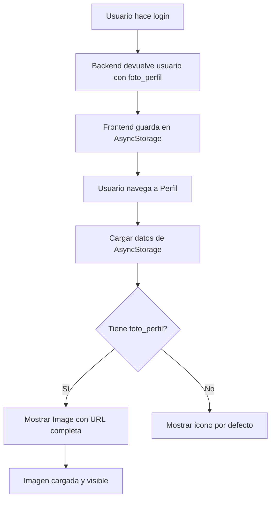

# Gestión de Foto de Perfil para Usuarios - Frontend

## Descripción
Se ha implementado la funcionalidad completa en el frontend para que los usuarios puedan subir su foto de perfil durante el registro y visualizarla en su perfil.

## Cambios Realizados

### 1. RegisterUserScreen.tsx

#### Imports Agregados
```typescript
import {
  Image,
  TouchableOpacity,
  Platform,
} from 'react-native';
import * as ImagePicker from 'expo-image-picker';
import { Ionicons } from '@expo/vector-icons';
```

#### Estado para la Foto
```typescript
const [photo, setPhoto] = useState<{ uri: string; name?: string; type?: string } | null>(null);
```

#### Función pickImage()
- Solicita permisos de galería
- Permite seleccionar imagen con edición (crop 1:1)
- Calidad de compresión: 0.7
- Genera nombre único: `profile_{timestamp}.{ext}`
- Detecta tipo MIME automáticamente

#### Modificación handleSubmit()
- **Antes**: Enviaba JSON simple
- **Ahora**: Envía FormData para soportar archivos
- Maneja diferencias entre Web y Móvil:
  - **Web**: Convierte URI a Blob
  - **Móvil**: Envía objeto `{uri, name, type}`
- Headers: `Content-Type: multipart/form-data`

#### UI para Foto de Perfil
Nueva sección agregada antes de "Datos Personales":

```tsx
<FormSection icon="📸" title="FOTO DE PERFIL (OPCIONAL)">
  <View style={styles.photoSection}>
    <TouchableOpacity onPress={pickImage}>
      {photo ? (
        <Image source={{ uri: photo.uri }} />
      ) : (
        <View style={styles.photoPlaceholder}>
          <Ionicons name="camera" size={40} />
          <Text>Toca para seleccionar</Text>
        </View>
      )}
    </TouchableOpacity>
    {photo && (
      <TouchableOpacity onPress={() => setPhoto(null)}>
        <Ionicons name="close-circle" />
        <Text>Eliminar foto</Text>
      </TouchableOpacity>
    )}
  </View>
</FormSection>
```

#### Estilos Agregados
```typescript
photoSection: {
  alignItems: 'center',
  gap: SPACING.md,
},
photoButton: {
  width: 150,
  height: 150,
  borderRadius: 75,
  overflow: 'hidden',
  borderWidth: 3,
  borderColor: COLORS.primary,
  borderStyle: 'dashed',
},
photoPreview: {
  width: '100%',
  height: '100%',
  resizeMode: 'cover',
},
photoPlaceholder: {
  width: '100%',
  height: '100%',
  justifyContent: 'center',
  alignItems: 'center',
  backgroundColor: COLORS.surface,
  gap: SPACING.xs,
},
photoPlaceholderText: {
  fontSize: TYPOGRAPHY.fontSize.xs,
  color: COLORS.text.secondary,
  textAlign: 'center',
},
removePhotoButton: {
  flexDirection: 'row',
  alignItems: 'center',
  gap: SPACING.xs,
  padding: SPACING.sm,
},
removePhotoText: {
  fontSize: TYPOGRAPHY.fontSize.sm,
  color: COLORS.error,
  fontWeight: TYPOGRAPHY.fontWeight.semiBold,
},
```

### 2. ProfileScreen.tsx

#### Imports Agregados
```typescript
import { Image } from 'react-native';

const API_BASE_URL = 'https://boxtiove.com';
```

#### Interfaz Usuario Actualizada
```typescript
interface Usuario {
  // ... campos existentes
  foto_perfil?: string; // NUEVO
}
```

#### Visualización de Avatar con Foto
```tsx
<View style={styles.avatarContainer}>
  {user.foto_perfil ? (
    <Image
      source={{ uri: `${API_BASE_URL}/${user.foto_perfil}` }}
      style={styles.avatarImage}
    />
  ) : (
    <Ionicons
      name={user.tipo_id === 2 ? 'fitness' : 'person'}
      size={60}
      color={COLORS.text.inverse}
    />
  )}
</View>
```

#### Estilos Agregados
```typescript
avatarContainer: {
  // ... estilos existentes
  overflow: 'hidden', // AGREGADO para que la imagen respete borderRadius
},
avatarImage: {
  width: '100%',
  height: '100%',
  resizeMode: 'cover',
},
```

## Flujo de Funcionamiento

### 1. Registro de Usuario con Foto

```mermaid
graph TD
    A[Usuario toca botón de cámara] --> B[Solicitar permisos]
    B --> C[Abrir galería]
    C --> D[Usuario selecciona y edita foto]
    D --> E[Guardar en estado como {uri, name, type}]
    E --> F[Mostrar preview]
    F --> G[Usuario completa formulario]
    G --> H[Submit presionado]
    H --> I[Crear FormData]
    I --> J{Hay foto?}
    J -->|Sí| K[Agregar foto a FormData]
    J -->|No| L[Solo datos de texto]
    K --> M[POST /api/usuarios/registro]
    L --> M
    M --> N[Backend guarda en files/usuarios/]
    N --> O[Respuesta con foto_perfil path]
```

### 2. Visualización en Perfil



## Estructura de URLs de Imágenes

### Backend almacena:
```
foto_perfil: "files/usuarios/1736634726_a3f8b2c1.jpg"
```

### Frontend construye URL completa:
```
https://boxtiove.com/files/usuarios/1736634726_a3f8b2c1.jpg
```

### Ejemplo en código:
```typescript
<Image source={{ uri: `${API_BASE_URL}/${user.foto_perfil}` }} />
// Resultado: https://boxtiove.com/files/usuarios/1736634726_a3f8b2c1.jpg
```

## Validaciones y Manejo de Errores

### En RegisterUserScreen
- ✅ Permisos de galería requeridos
- ✅ Solo permite seleccionar imágenes
- ✅ Compresión automática (quality: 0.7)
- ✅ Crop cuadrado forzado (aspect: [1, 1])
- ✅ Detección automática de tipo MIME
- ✅ Fallback a 'image/jpeg' si no se detecta
- ✅ Foto opcional (no es campo requerido)

### En ProfileScreen
- ✅ Manejo de usuarios sin foto (muestra icono)
- ✅ Fallback a icono si la imagen no carga
- ✅ URL completa construida correctamente
- ✅ Imagen responsive (resizeMode: 'cover')

## Compatibilidad Multiplataforma

### Web
```typescript
if (Platform.OS === 'web') {
  const response = await fetch(photo.uri);
  const blob = await response.blob();
  form.append('foto_perfil', blob, photo.name || 'foto.jpg');
}
```

### iOS/Android
```typescript
else {
  form.append('foto_perfil', {
    uri: photo.uri,
    name: photo.name || 'foto.jpg',
    type: photo.type || 'image/jpeg',
  } as any);
}
```

## Testing

### Registro con foto
```bash
# 1. Abrir app en simulador/dispositivo
# 2. Ir a "Crear Cuenta"
# 3. Tocar el círculo de cámara
# 4. Seleccionar imagen de galería
# 5. Editar/recortar imagen
# 6. Completar resto del formulario
# 7. Enviar registro
# 8. Verificar que se creó exitosamente
```

### Visualización en perfil
```bash
# 1. Iniciar sesión con usuario que tiene foto
# 2. Ir a pestaña "Perfil"
# 3. Verificar que la foto se muestra correctamente
# 4. Verificar que el avatar es circular
# 5. Verificar que tiene borde de color primary
```

### Sin foto (fallback)
```bash
# 1. Iniciar sesión con usuario SIN foto
# 2. Ir a pestaña "Perfil"
# 3. Verificar que se muestra icono de persona
# 4. Color del icono debe ser blanco (text.inverse)
```

## Dependencias Utilizadas

### Expo Image Picker
```json
"expo-image-picker": "^15.0.7"
```

#### Características:
- Selección de imágenes de galería
- Edición/crop de imágenes
- Manejo de permisos
- Soporte multiplataforma

### AsyncStorage
```json
"@react-native-async-storage/async-storage": "^1.23.1"
```

#### Uso:
- Almacenar datos de usuario después del login
- Cargar datos en ProfileScreen

### Axios (FormData)
```json
"axios": "^1.7.9"
```

#### Uso:
- Envío de FormData con foto
- Headers automáticos para multipart/form-data

## Comparación con FighterFormScreen

La implementación sigue el mismo patrón que `FighterFormScreen.tsx`:

| Característica | FighterFormScreen | RegisterUserScreen |
|----------------|-------------------|-------------------|
| Image Picker | ✅ expo-image-picker | ✅ expo-image-picker |
| Calidad | 0.7 | 0.7 |
| Aspect Ratio | [1, 1] | [1, 1] |
| FormData | ✅ | ✅ |
| Web/Móvil handling | ✅ | ✅ |
| Preview circular | ✅ | ✅ |
| Botón eliminar | ✅ | ✅ |
| Campo opcional | ✅ | ✅ |

## Próximos Pasos (Opcionales)

- [ ] Implementar edición de foto de perfil
- [ ] Agregar botón de cámara (además de galería)
- [ ] Implementar compresión más agresiva para datos móviles
- [ ] Agregar loading state mientras se sube la foto
- [ ] Implementar caché de imágenes
- [ ] Agregar placeholder mientras la imagen carga
- [ ] Implementar cambio de foto desde ProfileScreen
- [ ] Agregar badge de "verificado" si tiene foto

## Troubleshooting

### La imagen no se muestra en el perfil
1. Verificar que `foto_perfil` viene en el objeto usuario desde el backend
2. Verificar la URL completa en consola: `console.log(`${API_BASE_URL}/${user.foto_perfil}`)`
3. Verificar que el archivo existe en `backend/files/usuarios/`
4. Verificar permisos del directorio (777)

### Error al subir imagen
1. Verificar que el backend acepta `multipart/form-data`
2. Verificar tamaño máximo de archivo en PHP (`upload_max_filesize`)
3. Verificar permisos de escritura en `backend/files/usuarios/`
4. Revisar logs del servidor: `/var/log/apache2/error.log`

### Imagen muy pesada
1. Reducir `quality` en ImagePicker (actualmente 0.7)
2. Implementar compresión adicional con `expo-image-manipulator`
3. Limitar tamaño máximo de imagen antes de subir

## Archivos Modificados

1. ✅ [RegisterUserScreen.tsx](src/screens/RegisterUserScreen.tsx)
2. ✅ [ProfileScreen.tsx](src/screens/ProfileScreen.tsx)

## Archivos del Backend (Referencia)

1. ✅ [UsuariosController.php](../backend/controllers/UsuariosController.php)
2. ✅ [index.php](../backend/public/index.php) - Rutas API
3. ✅ [database_schema_NUEVO.sql](../backend/database/database_schema_NUEVO.sql)
4. ✅ Directorio: `/backend/files/usuarios/`

## Documentación Relacionada

- [FOTO_PERFIL_USUARIOS.md](../backend/FOTO_PERFIL_USUARIOS.md) - Documentación del backend
- [FighterFormScreen.tsx](src/screens/FighterFormScreen.tsx) - Referencia de implementación
- [Expo Image Picker Docs](https://docs.expo.dev/versions/latest/sdk/imagepicker/)
